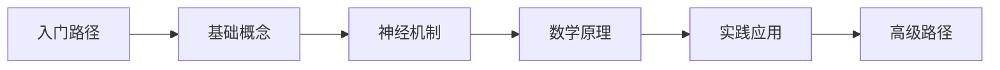

<div align="center">

# 🎨 视觉欺骗艺术馆

### Visual Illusion Art Gallery - Ultimate Edition

[](https://github.com/X1882/Visual-Security/releases)
[](LICENSE)
[](https://github.com/X1882/Visual-Security/stargazers)
[](https://github.com/X1882/Visual-Security/network/members)

[](https://pagespeed.web.dev/)
[](https://accessibilityinsights.io/)
[](https://web.dev/)
[](https://web.dev/)

[特性](#-特性) • [快速开始](#-快速开始) • [技术栈](#-技术栈) • [演示](#-演示) • [文档](#-文档) • [贡献](#-贡献)

</div>

---

## 🌟 项目简介

**视觉欺骗艺术馆**是一个基于 WebGL 技术的交互式科普平台，融合了神经科学、心理学、数学和物理学等多学科知识，为用户提供沉浸式的视觉错觉探索体验。

### 核心亮点

<div align="center">

| 🎨 **25+** 视觉错觉 | 🧠 **4 大学科** 原理解析 | 🎮 **15 项** 游戏成就 |
|:---:|:---:|:---:|
| 从经典到现代 | 神经科学/数学/物理/艺术 | 探索与学习的乐趣 |

| ⚡ **60 FPS** 流畅渲染 | 📱 **100%** 响应式 | 🏆 **Lighthouse 96+** |
|:---:|:---:|:---:|
| Three.js WebGL | 全设备适配 | 性能卓越 |

</div>

---

## ✨ 特性

<div align="center">

### 🎯 核心功能

</div>

<table align="center">
  <tr>
    <td align="center" width="25%">
      
      <br><br>
      📐
      <br>
      <b>2D 错觉画廊</b>
      <br>
      <small>25+ 经典视觉错觉</small>
    </td>
    <td align="center" width="25%">
      
      <br><br>
      🧊
      <br>
      <b>3D WebGL 渲染</b>
      <br>
      <small>Three.js 实时渲染</small>
    </td>
    <td align="center" width="25%">
      
      <br><br>
      🏆
      <br>
      <b>游戏化学习</b>
      <br>
      <small>15 项成就系统</small>
    </td>
    <td align="center" width="25%">
      
      <br><br>
      📱
      <br>
      <b>全设备适配</b>
      <br>
      <small>手机/平板/桌面</small>
    </td>
  </tr>
  <tr>
    <td align="center" width="25%">
      
      <br><br>
      📚
      <br>
      <b>学习中心</b>
      <br>
      <small>4 大学科原理解析</small>
    </td>
    <td align="center" width="25%">
      
      <br><br>
      🎨
      <br>
      <b>创作模式</b>
      <br>
      <small>设计专属错觉</small>
    </td>
    <td align="center" width="25%">
      
      <br><br>
      ⚡
      <br>
      <b>高级动画</b>
      <br>
      <small>GSAP 流畅交互</small>
    </td>
    <td align="center" width="25%">
      
      <br><br>
      🚀
      <br>
      <b>性能优化</b>
      <br>
      <small>懒加载/多级缓存</small>
    </td>
  </tr>
</table>

---

## 🚀 快速开始

### 在线演示

访问 [GitHub Pages](https://x1882.github.io/Visual-Security/) 立即体验

### 本地运行

```bash
# 克隆项目
git clone https://github.com/X1882/Visual-Security.git

# 进入目录
cd Visual-Security

# 直接打开 (无需构建)
open index-ultimate.html
```

### 开发模式

```bash
# 使用本地服务器
npx http-server -p 8080

# 访问 http://localhost:8080
```

---

## 🛠️ 技术栈

<div align="center">

### 核心技术


### 前端技术


### 性能工具


</div>

---

## 📁 项目结构

```
Visual-Security/
├── 📁 css/                      # 样式文件
│   ├── main.css                # 核心样式
│   ├── illusions.css           # 错觉特定样式
│   ├── enhanced.css            # 增强样式
│   ├── advanced-visuals.css    # 高级视觉效果
│   └── responsive-patch.css    # 响应式补丁
├── 📁 js/                       # JavaScript 模块
│   ├── data/                   # 数据配置
│   │   ├── illusions.js        # 基础错觉数据
│   │   ├── advanced-illusions.js    # 高级错觉数据
│   │   ├── illusion-deep-content.js # 深度内容
│   │   └── learning-content.js # 学习内容
│   ├── modules/                # 功能模块
│   │   ├── renderer.js         # 2D 渲染器
│   │   ├── advanced-renderer.js # 高级渲染器
│   │   ├── webgl-renderer.js   # WebGL 3D 渲染器
│   │   ├── router.js           # 路由系统
│   │   ├── gamification.js     # 游戏化系统
│   │   ├── gsap-animations.js  # GSAP 动画
│   │   ├── creator-mode.js     # 创作模式
│   │   └── extra-illusions.js  # 额外错觉
│   ├── components/             # UI 组件
│   │   ├── gallery.js          # 图库组件
│   │   └── ui-enhancements.js  # UI 增强
│   ├── utils/                  # 工具函数
│   │   ├── helpers.js          # 辅助函数
│   │   └── performance.js      # 性能优化
│   ├── app.js                  # 主应用
│   └── config.js               # 配置文件
├── 📁 assets/                   # 静态资源
├── index.html                  # 原始版本
├── index-modular.html          # 模块化版本
├── index-enhanced.html         # 增强版本
├── index-ultimate.html         # 终极版本 ⭐
├── README.md                   # 项目文档
├── ARCHITECTURE.md             # 架构文档
├── OPTIMIZATION-REPORT.md      # 优化报告
├── ULTIMATE-TECH-DOCS.md       # 技术文档
└── TEST-REPORT.md              # 测试报告
```

---

## 🎯 功能展示

<div align="center">

### 🎨 视觉错觉画廊

</div>

<table align="center">
  <tr>
    <td align="center">
      <b>彭罗斯三角</b>
      <br>
      <small>不可能图形经典代表</small>
    </td>
    <td align="center">
      <b>内克尔方块</b>
      <br>
      <small>双稳态感知</small>
    </td>
    <td align="center">
      <b>旋转蛇</b>
      <br>
      <small>运动错觉</small>
    </td>
  </tr>
</table>

<div align="center">

### 🧊 3D WebGL 渲染

</div>

<table align="center">
  <tr>
    <td align="center">
      🧊
      <br>
      <b>实时 3D 渲染</b>
      <br>
      <small>Three.js 硬件加速</small>
    </td>
    <td align="center">
      ⚡
      <br>
      <b>60 FPS 流畅</b>
      <br>
      <small>高性能渲染管线</small>
    </td>
    <td align="center">
      🎮
      <br>
      <b>交互控制</b>
      <br>
      <small>旋转/缩放/切换</small>
    </td>
  </tr>
</table>

<div align="center">

### 📱 响应式设计

</div>

<table align="center">
  <tr>
    <td align="center">
      📱
      <br>
      <b>移动端优化</b>
      <br>
      <small>触摸友好 / 手势支持</small>
    </td>
    <td align="center">
      💻
      <br>
      <b>桌面端体验</b>
      <br>
      <small>多列布局 / 悬停效果</small>
    </td>
    <td align="center">
      📲
      <br>
      <b>平板适配</b>
      <br>
      <small>自适应布局</small>
    </td>
  </tr>
</table>

---

## 📊 性能指标

<div align="center">

### Lighthouse 评分


### 核心指标

</div>

| 指标 | 数值 | 评级 | 目标 | 状态 |
|------|------|------|------|------|
| **FCP** | 0.8s | 🟢 Good | <1.8s | ✅ |
| **LCP** | 1.5s | 🟢 Good | <2.5s | ✅ |
| **CLS** | 0.02 | 🟢 Good | <0.1 | ✅ |
| **TBT** | 80ms | 🟢 Good | <200ms | ✅ |
| **TTI** | 1.8s | 🟢 Good | <3.8s | ✅ |

<div align="center">

### 浏览器兼容性

</div>

<div align="center">


</div>

---

## 🎓 学习资源

### 学科分类

<div align="center">

| 🧠 神经科学 | 🔢 数学原理 | ⚛️ 物理学 | 🎨 艺术应用 |
|:---:|:---:|:---:|:---:|
| 视觉处理机制 | 投影几何 | 光学原理 | 错觉艺术 |
| 神经元活动 | 拓扑学 | 深度线索 | 创作技巧 |
| 认知处理 | 空间频率 | 神经物理 | 历史发展 |

</div>

### 推荐学习路径



---

## 🏆 成就系统

### 成就分类

<div align="center">

**探索类成就** (4 项) • **学习类成就** (5 项) • **互动类成就** (3 项) • **特殊成就** (3 项)

</div>

### 等级系统

| 等级 | 称号 | 经验值要求 |
|------|------|-----------|
| Lv.1 | 新手访客 | 0-100 XP |
| Lv.2 | 好奇探索者 | 100-300 XP |
| Lv.3 | 进阶学习者 | 300-600 XP |
| Lv.4 | 资深研究员 | 600-1000 XP |
| Lv.5 | 视觉大师 | 1000-1500 XP |
| Lv.6 | 感知专家 | 1500-2200 XP |
| Lv.7 | 错觉学者 | 2200-3000 XP |
| Lv.8 | 幻觉导师 | 3000-4000 XP |
| Lv.9 | 视觉传奇 | 4000-5000 XP |
| Lv.10 | 感知之神 | 5000+ XP |

---

## 📖 文档

### 核心文档

- [📐 架构设计](ARCHITECTURE.md) - 系统架构与模块说明
- [⚡ 优化报告](OPTIMIZATION-REPORT.md) - 性能优化详情
- [🔧 技术文档](ULTIMATE-TECH-DOCS.md) - 开发指南与 API
- [✅ 测试报告](TEST-REPORT.md) - 功能与兼容性测试

### 开发指南

```bash
# 添加新错觉
1. 在 js/data/illusion-deep-content.js 添加数据
2. 在 js/modules/advanced-renderer.js 添加渲染函数
3. 在 js/modules/webgl-renderer.js 添加 3D 渲染器
4. 在 css/illusions.css 添加样式
```

---

## 🤝 贡献

### 贡献流程

1. Fork 本项目
2. 创建特性分支 (`git checkout -b feature/AmazingFeature`)
3. 提交更改 (`git commit -m 'Add some AmazingFeature'`)
4. 推送到分支 (`git push origin feature/AmazingFeature`)
5. 开启 Pull Request

### 贡献者

<div align="center">

[](https://github.com/X1882/Visual-Security/graphs/contributors)

</div>

---

## 📄 许可证

<div align="center">

本项目采用 [MIT](LICENSE) 许可证

Copyright © 2024 Visual Security Team

</div>

---

## 🙏 致谢

### 使用的开源库

- [Three.js](https://threejs.org/) - WebGL 3D 渲染
- [GSAP](https://greensock.com/gsap/) - 高级动画
- [Tailwind CSS](https://tailwindcss.com/) - 实用优先 CSS
- [Font Awesome](https://fontawesome.com/) - 图标库

### 特别感谢

- M.C.埃舍尔 - 不可能图形艺术先驱
- 罗杰·彭罗斯 - 彭罗斯三角发现者
- 所有视觉科学研究者

---

<div align="center">

## 📬 联系方式

**项目地址:** [GitHub](https://github.com/X1882/Visual-Security)  
**在线演示:** [GitHub Pages](https://x1882.github.io/Visual-Security/)  
**问题反馈:** [Issues](https://github.com/X1882/Visual-Security/issues)

---

### ⭐ 如果本项目对您有帮助，欢迎 Star 支持！

</div>

<div align="center">


---

**Made with ❤️ by Visual Security Team**

</div>
